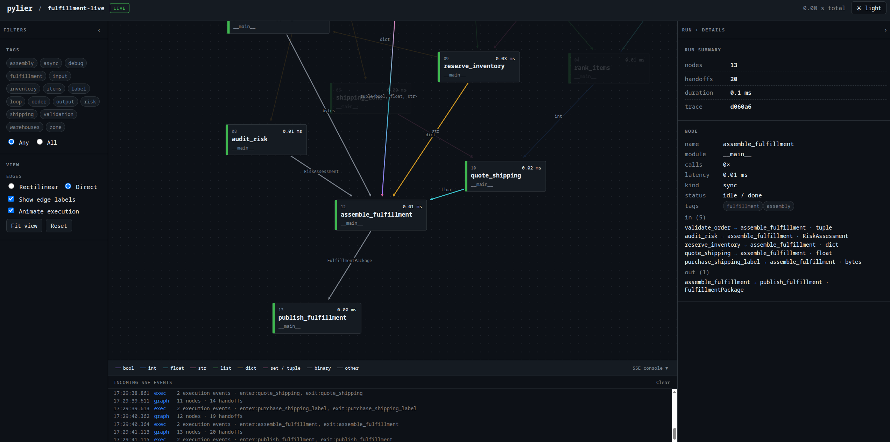

<div align="center">

# pylier

### See the data moving through your Python pipeline.

<p>
  Decorate the functions you already have. pylier infers the data handoffs and
  renders the pipeline that actually ran—no graph DSL or manual edge wiring.
</p>

<p>
  <a href="https://github.com/theMladyPan/pylier"></a>
  <a href="https://github.com/theMladyPan/pylier"></a>
  
</p>

<a href="examples/ingest.py">
  
</a>

</div>

## Why pylier?

<table>
<tr>
<td width="33%" align="center">
<b>Decorate, don't rebuild</b>
<p>Mark ordinary sync or async functions with <code>@pylier.node</code>. Your application code remains the pipeline.</p>
</td>
<td width="33%" align="center">
<b>Follow real data</b>
<p>Edges are inferred from the values passed between stages, so the graph reflects execution instead of a hand-maintained diagram.</p>
</td>
<td width="33%" align="center">
<b>Inspect it anywhere</b>
<p>Write a self-contained HTML graph for sharing, or open a live in-process viewer while the pipeline runs.</p>
</td>
</tr>
</table>

## Quick start: document ingestion

The [ingestion example](examples/ingest.py) is the fastest way to see pylier's
value: a document branches into text and image paths, then converges at an
indexing stage.

```bash
git clone https://github.com/theMladyPan/pylier.git
cd pylier
uv sync
uv run python -m examples.ingest html
```

Open `pylier-ingest.html` in a browser. It is a self-contained file—no server
required. To watch the graph grow as work happens instead:

```bash
uv run python -m examples.ingest serve
# viewer: http://localhost:8765
```

## The whole API in one flow

```python
import pylier


@pylier.node
def load_document(path: str) -> dict: ...


@pylier.node(_tags=["document", "text"])
def extract_text(document: dict) -> list[str]: ...


@pylier.node
def embed(chunks: list[str]) -> list[dict]: ...


with pylier.trace("document-ingest"):
    document = load_document("report.pdf")
    vectors = embed(extract_text(document))

pylier.render("document-ingest.html")  # interactive, standalone HTML
```

A returned value that later becomes a function argument creates an edge. For a
plain-Python transformation or join that loses that relationship, preserve its
sources explicitly:

```python
vectors = pylier.derive(text_vectors + image_vectors, from_=[text_vectors, image_vectors])
```

`derive()` returns the original value unchanged; its only job is to keep the
branch lineage visible in the next decorated stage.

## Built for useful traces

- **Signal over noise** — use `core`, `info`, `debug`, and `trace` capture
  levels to control both captured nodes and metadata detail.
- **Useful inspection** — filter by node tags; click graph nodes and edges for
  payload type, size, preview, and optional captured values.
- **Share or stream** — `pylier.render()` creates a portable HTML file;
  `pylier.serve()` streams updates to a local viewer with SSE.
- **Keep an audit trail** — `pylier.trace(..., sidecar="trace.jsonl")` writes
  already-resolved events to JSONL for offline consumers.

## Coexistence with other tracers

pylier has no OpenTelemetry, Logfire, FastAPI, or cloud dependency. It records
its own local decorator traces and does not mutate ambient tracing context, so
another tracer can instrument the same process independently.

## Development

```bash
uv run pytest
uv run ruff format src tests examples
uv run ruff check src tests examples
```

## Contributing

Issues and pull requests are welcome at
[theMladyPan/pylier](https://github.com/theMladyPan/pylier).
